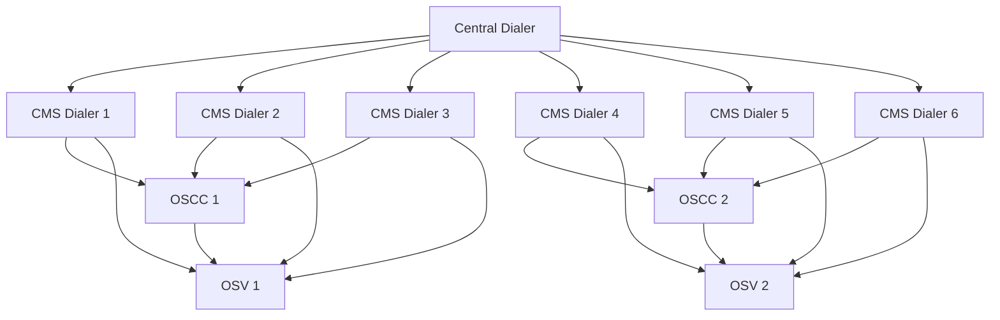
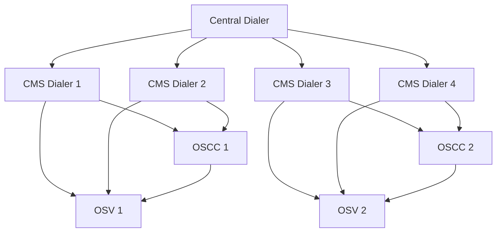
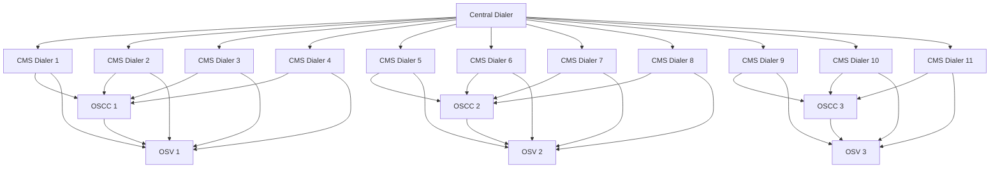
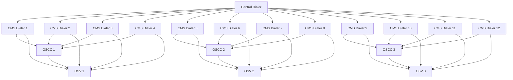

# Home Credit Project

## Introduction

The Home Credit system has the main objetive to provide dialers to attend 5 locations:

- India
- Vietnam
- Philippines
- Indonesia
- Kazakhstan

## Basic Requirements

- CMS Dialer - supports 300 channels and 100000 calls per hour
- OSCC supports 1500 agents and 24000 calls per hour
- OSV  - for now an assumption of 100 cps raw calls and 6.7 cps ACD calls.


## Architecture

### India

- 6 million calls per day --> 600000 cph --> 166.7 cps
- 27000 OSCC cph (4.5% success rate)
- 3200 agents



### Vietnam

- 4 million calls per day --> 400000 cph --> 111.1 cps
- 18000 cph (4.5% success rate)
- 900 agents



### Philippines

- 11 million calls per day --> 1100000 cph --> 305.6 cps
- 49500 OSCC cph (4.5% success rate)
- 1300 agents



### Indonesia

- 12 million calls per day --> 1200000 cph --> 333.3 cps
- 54000 OSCC cph (4.5% success rate)
- 900 agents



### Kazakhstan

- 1 million calls per day --> 100000 cph --> 27.8 cps
- 4500 OSCC cph (4.5% success rate)
- 600 agents

```mermaid
graph TD
    A[Central Dialer] --> B[CMS Dialer 1]
    A --> C[CMS Dialer 2]
    B --> M[OSCC 1]
    C --> M
    M --> O[OSV]
 ```
